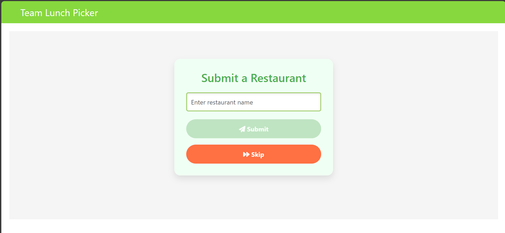
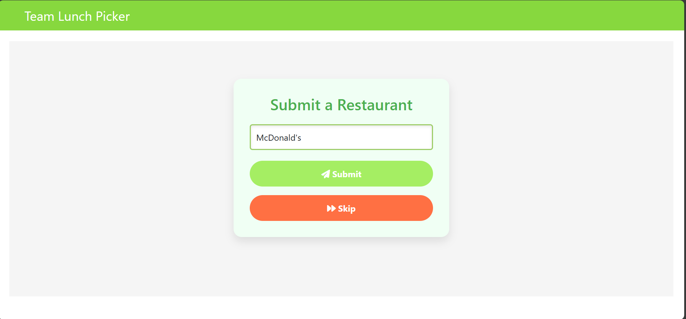
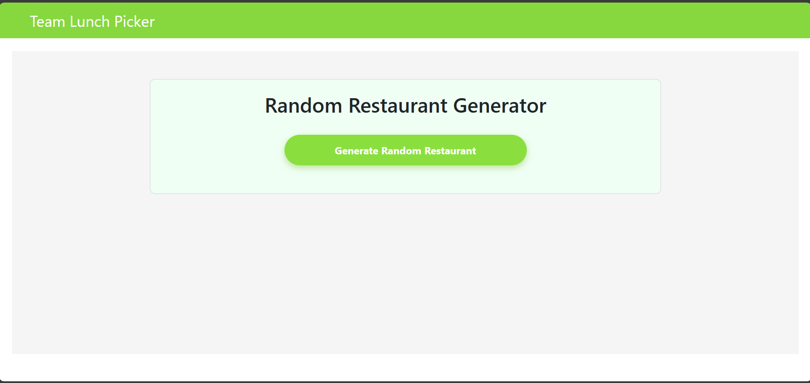
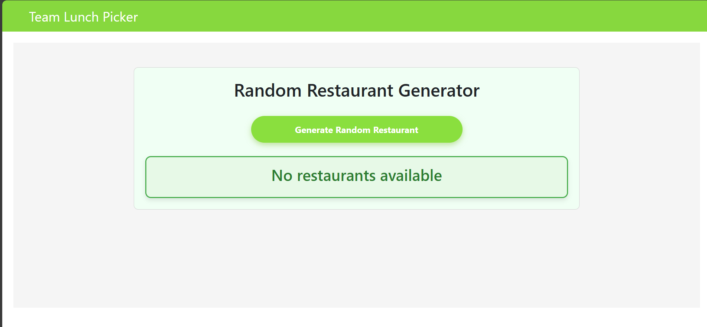
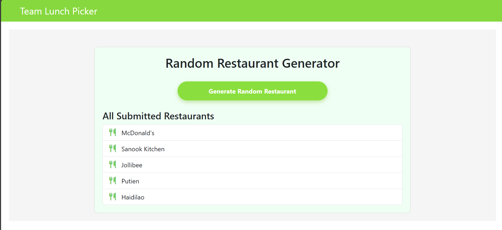
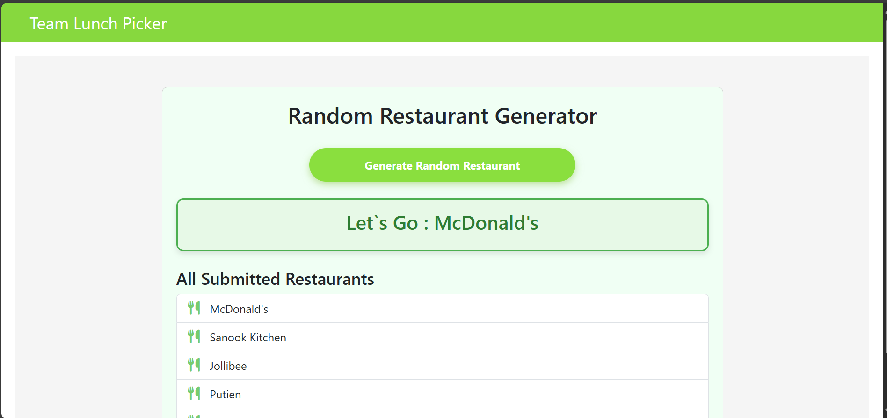
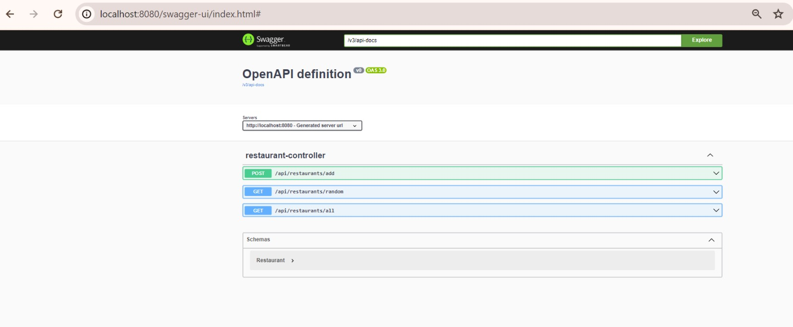
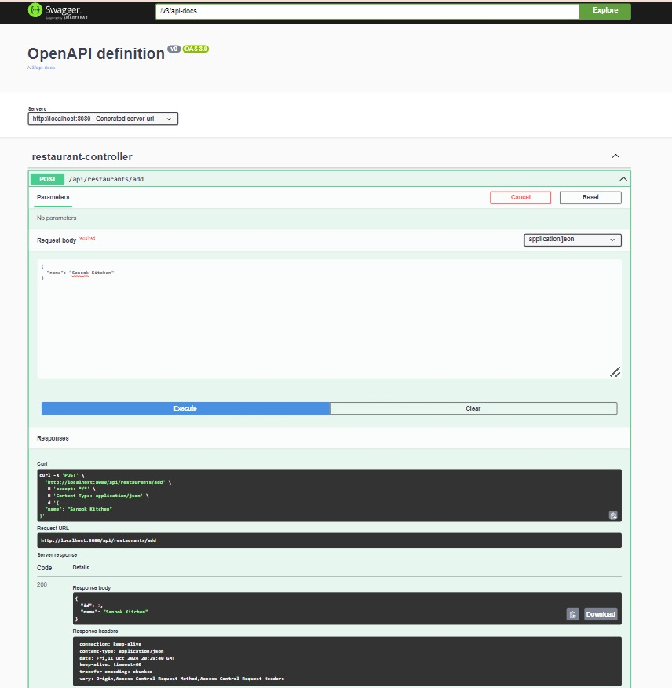
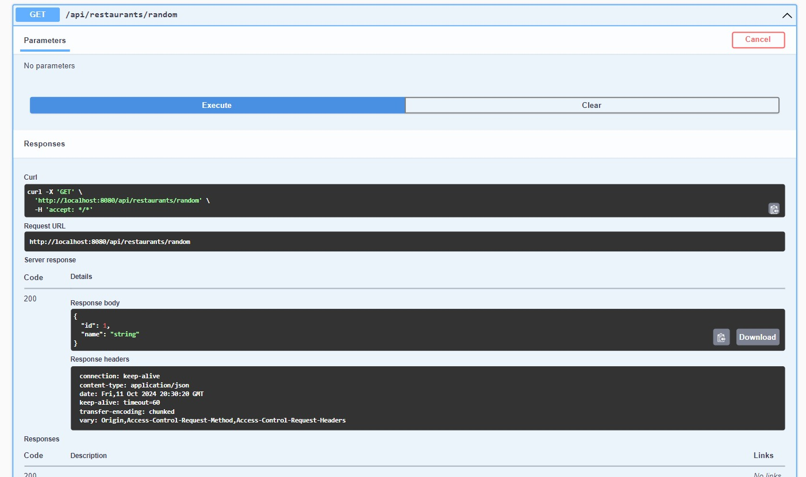

# Team-Lunch-Picker

A web application that helps teams collectively decide on a lunch location by submitting restaurant choices and randomly selecting one from the submitted options.

## Overview

The **Team-Lunch-Picker** allows users to submit restaurant choices via a web interface. The system stores these restaurant choices and provides a random selection from the submitted entries. This is useful for teams who are struggling to decide where to go for lunch.

## Technologies Used

### Front-End

- **Angular 17.1.0: The latest version of Angular for building a modern, dynamic, and efficient single-page application (SPA).
- **Bootstrap 5.3.0: A popular CSS framework used for creating responsive and mobile-first web designs.

### Back-End

- **Spring Boot 3.3.4: A framework for building the RESTful API.
- **Spring Data JPA**: A persistence framework to interact with relational databases.
- **H2 Database**: An in-memory database used for development and testing.
- **Springdoc OpenAPI**: For generating API documentation and providing a Swagger UI.
- **Swagger UI**: To interact with and test the APIs.

## Features

1. **Add Restaurant**: Users can submit a restaurant via the API, and it gets stored in the database.
2. **Get Random Restaurant**: Retrieve a random restaurant from the submitted list.
3. **View All Restaurants**: Get a list of all the restaurants that have been submitted.


## Installation

### Front-End Setup

1. Install Angular CLI globally (if not already installed):
    ```bash
    npm install -g @angular/cli
    ```

2. Navigate to the front-end folder:
    ```bash
    cd Team-Lunch-Picker-Client
    ```

3. Install dependencies:
    ```bash
    npm install
    ```

4. Start the Angular development server:
    ```bash
    ng serve
    ```

5. The Angular app will be available at `http://localhost:4200`.


### Back-End Setup

1. Clone the project repository.
2. Navigate to the Spring Boot project directory.
3. Update the database configuration.

   #### For H2 Database (Development):
   By default, the project uses an in-memory H2 database for development. No additional configuration is required.

4. Run the Spring Boot application using IDE or terminal:

5. The back-end will be accessible at http://localhost:8080

### Swagger UI
Once the back-end is running, Swagger UI is available for API documentation and interaction at:

http://localhost:8080/swagger-ui.html

## Endpoints
Here are the API endpoints:

POST /api/restaurants/add: Submit a new restaurant.

GET /api/restaurants/random: Get a random restaurant from the submitted list.

GET /api/restaurants/all: Get all submitted restaurants.

### Example API Requests
POST: Submit a new restaurant
Request:
{
  "name": "Sanook Kitchen"
}

GET: Get a random restaurant
Response:

{
  "id": 1,
  "name": "Sanook Kitchen"
}

GET: Get all restaurants
Response:

[
 {
  "id": 1,
  "name": "Sanook Kitchen"
 }
]

## Screenshots

### Front-End














### Back-end API






